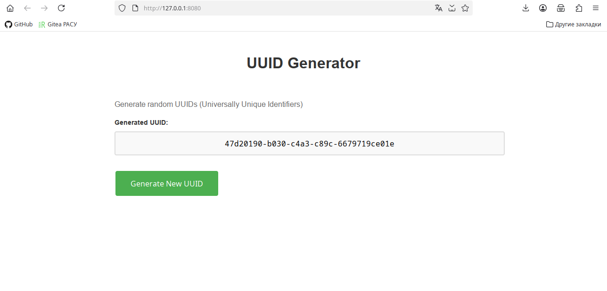

# UUID Online Generator Tool



## Building and Running

### Create build directory and build:

```bash

mkdir build
cd build
cmake ..
cmake --build .
```

### Run the application:

```bash

# Run on port 8080
./uuid-generator --approot . --docroot . --http-address 0.0.0.0 --http-port 8080 --resources-dir=/usr/local/share/Wt/resources

# Output
[2025-Oct-16 07:54:52.942] 3039894 - [info] "config: reading Wt config file: /etc/wt/wt_config.xml (location = './uuid-generator')"
[2025-Oct-16 07:54:52.942] 3039894 - [warning] "WResource: setInternalPath(): adding '/' to start of internal path: styles.css"
[2025-Oct-16 07:54:52.942] 3039894 - [info] "WServer/wthttp: initializing built-in wthttpd"
[2025-Oct-16 07:54:52.957] 3039894 - [info] "wthttp: started server: http://0.0.0.0:8080"
[2025-Oct-16 07:55:01.264] 3039894 - [info] "Wt: session created (#sessions = 1)"
[2025-Oct-16 07:55:01.264] 3039894 [/ 5IQjpVqZiJGo2cwW] [info] "WEnvironment: UserAgent: Mozilla/5.0 (X11; Linux x86_64; rv:140.0) Gecko/20100101 Firefox/140.0"
[2025-Oct-16 07:55:01.265] 3039894 - [access] "wthttp: 127.0.0.1   GET / HTTP/1.1 200 2103"
[2025-Oct-16 07:55:01.265] 3039894 - [info] "WebRequest: took 0.779 ms"
[2025-Oct-16 07:55:01.579] 3039894 - [access] "wthttp: 127.0.0.1   GET /?wtd=5IQjpVqZiJGo2cwW&request=style&page=1 HTTP/1.1 200 95"
[2025-Oct-16 07:55:01.579] 3039894 - [info] "WebRequest: took 219.051 ms"
[2025-Oct-16 07:55:01.579] 3039894 - [access] "wthttp: 127.0.0.1   GET /favicon.ico HTTP/1.1 404 85"
[2025-Oct-16 07:55:01.581] 3039894 - [access] "wthttp: 127.0.0.1   GET /?wtd=5IQjpVqZiJGo2cwW&sid=2969865308&webGL=true&scrW=1920&scrH=1080&tz=420&tzS=Asia%2FNovosibirsk&htmlHistory=true&deployPath=%2F&request=script&rand=910325369 HTTP/1.1 200 17308"
[2025-Oct-16 07:55:01.581] 3039894 - [info] "WebRequest: took 2.931 ms"
[2025-Oct-16 07:55:01.607] 3039894 - [access] "wthttp: 127.0.0.1   GET /resources/themes/default/wt.css HTTP/1.1 200 20654"
[2025-Oct-16 07:55:01.608] 3039894 - [access] "wthttp: 127.0.0.1   GET /resources/moz-transitions.css HTTP/1.1 200 6277"
[2025-Oct-16 07:55:01.608] 3039894 - [access] "wthttp: 127.0.0.1   GET /styles.css HTTP/1.1 200 394"
[2025-Oct-16 07:55:01.608] 3039894 - [info] "WebRequest: took 0.168 ms"
[2025-Oct-16 07:55:01.618] 3039894 - [info] "wthttp: ws: connect with protocol version 13"
[2025-Oct-16 07:55:01.619] 3039894 - [info] "WebRequest: took 0.072 ms"
[2025-Oct-16 07:55:01.795] 3039894 - [access] "wthttp: 127.0.0.1   POST /?wtd=5IQjpVqZiJGo2cwW HTTP/1.1 200 48"
[2025-Oct-16 07:55:01.795] 3039894 - [info] "WebRequest: took 0.29 ms"
[2025-Oct-16 07:55:01.798] 3039894 [/ 5IQjpVqZiJGo2cwW] [info] "WebRequest: took 0.043 ms"
[2025-Oct-16 07:55:24.053] 3039894 [/ 5IQjpVqZiJGo2cwW] [info] "WebRequest: took 0.077 ms"
[2025-Oct-16 07:55:24.053] 3039894 [/ 5IQjpVqZiJGo2cwW] [info] "WebController: Removing session 5IQjpVqZiJGo2cwW"
[2025-Oct-16 07:55:24.053] 3039894 - [access] "wthttp: 127.0.0.1   GET /?wtd=5IQjpVqZiJGo2cwW&request=ws HTTP/1.1 101 13"
[2025-Oct-16 07:55:24.053] 3039894 [/ 5IQjpVqZiJGo2cwW] [info] "Wt: session destroyed (#sessions = 0)"
[2025-Oct-16 07:55:24.053] 3039894 - [info] "WebRequest: took 22434.7 ms"
^CShutdown (signal = 2)
[2025-Oct-16 07:55:30.249] 3039894 - [info] "WebController: shutdown: stopping 0 sessions."
[2025-Oct-16 07:55:30.249] 3039894 - [info] "WServer/wthttp: Shutdown: stopping web server."
```

### Access the application:

Open your web browser and navigate to http://localhost:8080

#### Features

- UUID Generation: Generates RFC-compliant UUID version 4 (random)
- User Interface: Clean, responsive web interface
- Copy Functionality: Users can easily copy the generated UUID from the text field
- New Generation: Button to generate a new UUID on demand
- Proper Formatting: UUIDs are displayed in the standard 8-4-4-4-12 format

#### Dependencies

- C++14 compatible compiler
- CMake 3.10+
- Emweb Wt Toolkit (libwt-dev, libwthttp-dev)
- PkgConfig

### Installation on Ubuntu/Debian:

```bash
sudo apt-get update
sudo apt-get install libwt-dev libwthttp-dev cmake pkg-config build-essential
```

The application will start a web server on the specified port (default 8080) and serve the UUID generator interface. Users can generate new UUIDs by clicking the button and copy them from the read-only text field.
